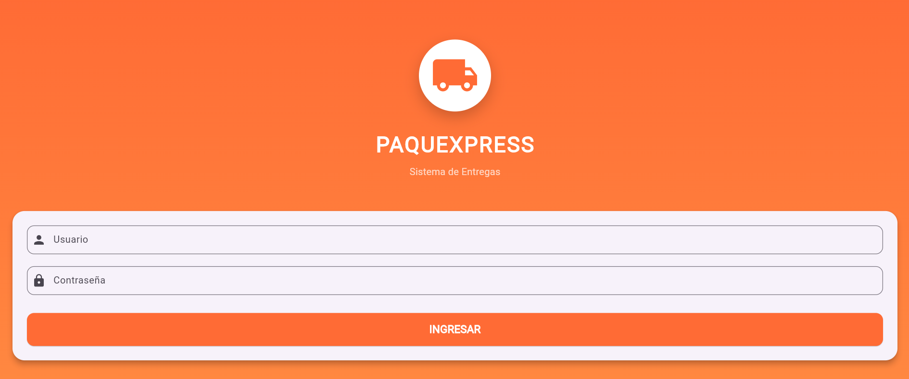
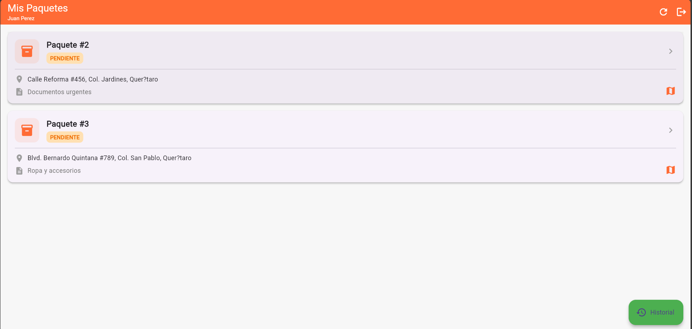
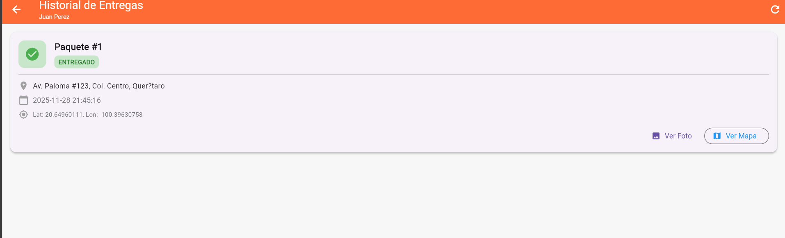

# PAQUEXPRESS - Sistema de Gestión de Entregas


Sistema completo de gestión de entregas de paquetes con captura de evidencia fotográfica, registro GPS y visualización en mapa interactivo.

## Características Principales

- ✅ **Autenticación segura** con encriptación MD5
- ✅ **Gestión de paquetes** asignados por repartidor
- ✅ **Captura de evidencia** fotográfica
- ✅ **Registro GPS** de ubicación de entrega
- ✅ **Mapa interactivo** con Google Maps
- ✅ **Historial de entregas** completadas
- ✅ **API RESTful** con FastAPI
- ✅ **Base de datos** MySQL relacional

## Stack Tecnológico

### Frontend
- **Flutter** - Framework multiplataforma
- **Dart** - Lenguaje de programación
- **Google Maps Flutter** - Mapas interactivos
- **Image Picker** - Captura de fotos
- **Geolocator** - Servicios de geolocalización

### Backend
- **FastAPI** - Framework web de Python
- **SQLAlchemy** - ORM para base de datos
- **Uvicorn** - Servidor ASGI
- **Python 3.8+** - Lenguaje del backend

### Base de Datos
- **MySQL 8.0+** - Sistema de gestión de base de datos

## Requisitos Previos

- Flutter SDK 3.0 o superior
- Python 3.8 o superior
- MySQL 8.0 o superior
- Git
- Navegador web moderno (Chrome recomendado)

## Instalación

### 1. Clonar el Repositorio
```bash
git clone https://github.com/hectorfrias4471/paquexpress-app.git
cd paquexpress-app
```

### 2. Configurar Base de Datos
```bash
# Iniciar MySQL
mysql -u root -p

# Ejecutar el script de creación
mysql -u root -p < database/script.sql
```

O ejecutar manualmente:
```sql
source database/script.sql
```

### 3. Configurar y Ejecutar API
```bash
# Navegar a la carpeta de la API
cd api

# Instalar dependencias de Python
pip install fastapi uvicorn sqlalchemy mysql-connector-python python-multipart

# Iniciar el servidor
uvicorn main:app --reload
```

La API estará disponible en: `http://localhost:8000`

Documentación interactiva: `http://localhost:8000/docs`

### 4. Configurar y Ejecutar App Flutter
```bash
# Navegar a la carpeta de la app
cd app/paquexpress_app

# Instalar dependencias
flutter pub get

# Ejecutar en Chrome (Web)
flutter run -d chrome
```

## Usuarios de Prueba

| Usuario | Contraseña | Rol |
|---------|------------|-----|
| repartidor1 | pass123 | Repartidor (3 paquetes asignados) |
| repartidor2 | pass456 | Repartidor (2 paquetes asignados) |
| admin | admin123 | Administrador |

## Estructura del Proyecto
```
paquexpress-app/
├── README.md
├── database/
│   └── script.sql              
├── api/
│   └── main.py                
├── app/
│   └── paquexpress_app/
│       ├── lib/
│       │   ├── main.dart       
│       │   ├── login_page.dart 
│       │   ├── paquetes_page.dart  
│       │   ├── entrega_page.dart   
│       │   ├── mapa_page.dart     
│       │   └── historial_page.dart 
│       ├── web/
│       │   └── index.html      
│       └── pubspec.yaml       
└── docs/
    └── capturas/              
```

## Modelo de Base de Datos

### Tabla: usuarios
- `id_usuario` (PK)
- `username`
- `password_hash` (MD5)
- `nombre_completo`
- `fecha_creacion`

### Tabla: paquetes
- `id_paquete` (PK)
- `id_usuario_asignado` (FK)
- `direccion_destino`
- `descripcion`
- `estatus` (pendiente/entregado)
- `fecha_asignacion`

### Tabla: entregas
- `id_entrega` (PK)
- `id_paquete` (FK)
- `id_usuario` (FK)
- `foto_evidencia` (Base64)
- `latitud`
- `longitud`
- `direccion_completa`
- `fecha_entrega`

## Endpoints de la API

| Método | Endpoint | Descripción |
|--------|----------|-------------|
| GET | `/` | Info de la API |
| POST | `/login/` | Autenticación de usuario |
| GET | `/paquetes/{id_usuario}` | Listar paquetes asignados |
| POST | `/entregas/` | Registrar nueva entrega |
| GET | `/entregas/{id_usuario}` | Historial de entregas |
| GET | `/entregas/{id_entrega}/foto` | Obtener foto de entrega |

## Flujo de Uso

1. **Login**: Usuario ingresa credenciales
2. **Lista de Paquetes**: Ve sus paquetes pendientes
3. **Selección**: Elige un paquete para entregar
4. **Evidencia Fotográfica**: Toma foto del paquete
5. **Ubicación GPS**: Obtiene coordenadas actuales
6. **Visualización**: (Opcional) Ver ubicación en mapa
7. **Registro**: Confirma entrega y guarda en BD
8. **Historial**: Puede revisar entregas pasadas

## Seguridad Implementada

- ✅ Encriptación de contraseñas con MD5
- ✅ Validación de datos en backend
- ✅ Control de acceso por usuario
- ✅ Manejo de errores y excepciones
- ✅ Validación de relaciones de base de datos
- ✅ CORS configurado para desarrollo

## Compatibilidad

- ✅ Flutter Web (Chrome, Firefox, Edge, Safari)
- ✅ Flutter Android (con ajustes en permisos)
- ✅ Flutter iOS (con ajustes en Info.plist)

## Sensores Utilizados

### Cámara (image_picker)
- Captura de fotos de evidencia
- Selección desde galería
- Compresión automática (70% calidad)

### GPS (geolocator)
- Obtención de coordenadas precisas
- Precisión alta (LocationAccuracy.high)
- Manejo de permisos automático

### Google Maps (google_maps_flutter)
- Visualización de ubicaciones
- Marcadores personalizados
- Controles de zoom y navegación

## Solución de Problemas

### La API no se conecta
```bash
# Verificar que MySQL esté corriendo
mysql.server start  # macOS/Linux
net start MySQL     # Windows

# Verificar conexión a BD
mysql -u root -p -e "USE db_paquexpress; SHOW TABLES;"
```

### Flutter no encuentra dependencias
```bash
flutter clean
flutter pub get
```

### Error de permisos GPS en navegador
- Asegúrate de permitir el acceso a ubicación cuando el navegador lo solicite
- Chrome: Configuración → Privacidad → Configuración de sitios → Ubicación

## 📄 Licencia

Este proyecto es parte de una evaluación académica - Desarrollo de Aplicaciones Móviles

## Autor

**Hector Frias**
- Universidad: [UTEQ]
- Matrícula: [2024310056]
- Materia: Desarrollo de Aplicaciones Móviles
- Cuatrimestre: 4to

---

## 📸 Capturas de Pantalla

### Login


### Lista de Paquetes


### Registro de Entrega


### Mapa Interactivo


### Historial


---

**Desarrollado con ❤️ para Paquexpress S.A. de C.V.**